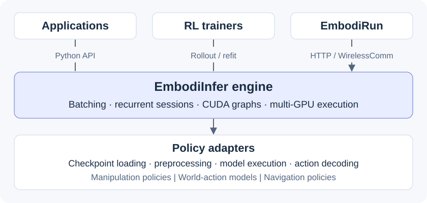

<p align="center">
  
</p>

<h3 align="center">One engine for embodied inference and RL rollout.</h3>
<p align="center">
  <a href="https://embodiinfer.readthedocs.io/">Documentation</a> ·
  <a href="#quick-start">Quick start</a> ·
  <a href="#supported-models">Models</a> ·
  <a href="#performance">Performance</a> ·
  <a href="README.zh-CN.md">简体中文</a>
</p>

<p align="center">
  <a href="LICENSE"></a>
  <a href="pyproject.toml"></a>
  <a href="https://embodiinfer.readthedocs.io/"></a>
</p>

**EmbodiInfer is an inference and RL-rollout engine for embodied models.** Run
manipulation policies, world-action models, and recurrent navigation policies
through a common Python interface, with model-specific execution optimizations
and shared batching, session, and multi-GPU machinery.

Embed it in your application or trainer, or serve predictions to
[EmbodiRun](https://github.com/BUAA-CI-LAB/EmbodiRun) for robot deployment and
execution.



## Why EmbodiInfer?

Optimize the model path. Reuse the engine from robot inference to RL rollout.

<table>
<tr>
<td width="50%" valign="top">
<h3>⚡ Capture, compile, replay</h3>
<p><b>CUDA Graphs · torch.compile / Inductor</b></p>
<p>Replay static prefix and decode paths and compile model computation. Policy-specific profiles target the repeated work in denoising and token generation.</p>
<a href="docs/en/architecture.md#cuda-graph-capture">Execution paths →</a>
</td>
<td width="50%" valign="top">
<h3>🎚️ Precision to fit your GPU</h3>
<p><b>BF16 · FP8 · INT8 · NVFP4</b></p>
<p>Choose hardware-specific π0.5 and StreamVLN profiles: INT8 on AGX Orin, FP8 on RTX 4090 and Thor, and NVFP4 on Thor.</p>
<a href="docs/en/models.md#optimization-profiles">Precision and backend guide →</a>
</td>
</tr>
<tr>
<td valign="top">
<h3>🔥 Optimized down to the operators</h3>
<p><b>Triton attention · fused model operations</b></p>
<p>Specialized attention kernels and fused normalization, rotary embeddings, and gated activations accelerate supported native model paths.</p>
<a href="docs/en/models.md#optimization-profiles">Native optimizations →</a>
</td>
<td valign="top">
<h3>🧠 Reuse context, retain history</h3>
<p><b>Prefix KV reuse · recurrent sessions</b></p>
<p>Reuse fixed observation context across denoising steps. Navigation policies retain episode history, with transactional updates and explicit reset and cancellation.</p>
<a href="docs/en/architecture.md#sessionstore">Context and session lifecycle →</a>
</td>
</tr>
<tr>
<td valign="top">
<h3>🚀 From one request to many environments</h3>
<p><b>Request batching · multi-GPU execution</b></p>
<p>Batch observations, aggregate asynchronous requests, and distribute work across replicas. Supported policies also offer tensor parallelism.</p>
<a href="docs/en/parallelism.md">Parallel execution →</a>
</td>
<td valign="top">
<h3>🔄 Inference that fits the RL loop</h3>
<p><b>Action sampling · log probabilities · weight refit</b></p>
<p>Use RL-capable decoders to collect rollouts and refresh policy weights. Keep your trainer and learning objective; reuse model execution.</p>
<a href="docs/en/api.md#generating-rl-rollouts">RL integration →</a>
</td>
</tr>
</table>

Choose features by policy and hardware in the [capability reference](docs/en/models.md#capabilities-and-installation).
Adapters own model-specific optimizations; the shared scheduler stays model-independent.

## Performance

### Lower latency on a single RTX 4090

Native inference optimizations reduced mean end-to-end latency by **47.7% for
π0.5** and **31.2% for GR00T N1.7**, compared with the earlier EmbodiInfer path:

| Policy | Before | Optimized | Optimized throughput |
|---|---:|---:|---:|
| [π0.5](benchmarks/pi05-benchmark/README.md#pi05-原生优化2026-09-09) | 74.33 ms | **38.89 ms** | **25.71 observations/s** |
| [GR00T N1.7](benchmarks/gr00t-benchmark/README.md#4090-原生优化2026-09-09) | 45.51 ms | **31.30 ms** | **31.95 observations/s** |

Recorded on September 9, 2026: RTX 4090, BF16, batch size 1, and 1,600 LIBERO-10
observations per model. π0.5 uses `pi05_libero_finetuned_v044_gitcode` with 10
denoising steps; GR00T uses `nvidia/GR00T-N1.7-LIBERO` with 4. Both paths use
Inductor and denoising CUDA graphs. The baseline uses SDPA; the optimized
paths add native inference and prefix graphs, with Triton prefix and denoising
attention for π0.5 and SDPA for GR00T.

Timing covers decoded CPU observations through CPU action output, after warmup
on 10 cross-task observations.
The linked reports include checkpoint details, environments, commands, numerical
checks, and batch-size sweeps. At **batch size 32**, the optimized GR00T path
reached **59.33 observations/s** on the same GPU.

Explore [navigation and world-action benchmarks](docs/en/benchmark.md),
[quantized π0.5](benchmarks/pi05-quant-benchmark/README.md),
[quantized StreamVLN](benchmarks/streamvln-quant-benchmark/README.md), and
[multi-GPU measurements](docs/en/parallelism.md).

## Supported models

✓ **Implemented** · ◐ **Experimental** · ○ **Planned**

<table>
<tr>
<th align="left">🦾 Manipulation</th>
<th align="left">🧭 Navigation</th>
<th align="left">🌐 World-action models</th>
</tr>
<tr>
<td valign="top">
<p>✓ <b>π0.5</b><br>✓ <b>GR00T N1.7</b><br>✓ <b>OpenVLA-OFT</b><br>✓ <b>LingBot-VLA</b><br>✓ <b>DM0.5</b></p>
<p>Manipulation policies with<br>RL decoder interfaces.</p>
</td>
<td valign="top">
<p>✓ <b>StreamVLN</b><br>✓ <b>Qwen R2R</b> · low / panoramic<br>✓ <b>NaViDA</b><br>◐ ActiveVLN</p>
<p>Episode-scoped history<br>and recurrent inference.</p>
</td>
<td valign="top">
<p>✓ <b>Cosmos Policy</b></p>
<p>Diffusion-based action generation<br>and candidate planning.</p>
</td>
</tr>
</table>

**Network serving:** π0.5, DM0.5, and StreamVLN through HTTP / WirelessComm,
at batch size 1. All model families have Python entry points.
The [capability reference](docs/en/models.md#capabilities-and-installation) covers
batching, CUDA graphs, RL interfaces, and installation profiles.
ActiveVLN's real-checkpoint GPU parity is pending.

### Planned models

- [ ] **SmolVLA** — model adapter, input processing, and serving integration.
- [ ] **OpenVLA** — base-model inference, separate from OpenVLA-OFT.

See the [model roadmap](docs/en/models.md#roadmap) for the implementation steps.
Robot and simulator integrations live in
[EmbodiRun](https://github.com/BUAA-CI-LAB/EmbodiRun#support-at-a-glance).

## Quick start

### Run without a checkpoint

For a first run without a checkpoint, install the core package with Python
3.10+ and [uv](https://docs.astral.sh/uv/) 0.12.x:

```bash
git clone https://github.com/BUAA-CI-LAB/EmbodiInfer.git
cd EmbodiInfer
uv sync --frozen
uv run python examples/quickstart.py
```

This CPU-friendly example uses a synthetic policy to walk through single and
batched requests and print their action-chunk shapes.
The Linux lock includes CUDA-enabled Torch wheels, so installation
can be large even on a CPU-only machine.

### Load π0.5

Use the isolated π0.5 profile and a CUDA GPU:

```bash
uv sync --python 3.12 --frozen --no-dev --group pi05
uv run --no-sync python examples/pi05_inference.py \
  --ckpt lerobot/pi05_base --envs 1
```

This example loads real weights but uses synthetic observations to demonstrate
the engine API. Follow [Quick start](docs/en/quickstart.md) for the input contract
and [Serving](docs/en/serving.md) to connect real observations and configure their
mapping to a checkpoint.

### Choose an integration

| Workflow | Interface | Start here |
|---|---|---|
| Inference inside an application | `EmbodiInfer.act(observation)` or `EmbodiInfer.act(observations)` | [Python API](docs/en/api.md) |
| Network inference for a robot runtime | HTTP / WirelessComm sessions | [Serve and send your first observation](docs/en/serving.md) |
| RL rollout and weight updates | Rollout / refit interfaces | [RL integration](docs/en/api.md#generating-rl-rollouts) |
| Multi-GPU execution | Data parallelism / tensor parallelism | [Parallelism](docs/en/parallelism.md) |

The network launchers support π0.5, DM0.5, and StreamVLN at batch size 1.
Other policies use the Python API. See the
[capability table](docs/en/models.md#capabilities-and-installation) for policy-specific support.

The distribution is named `embodiinfer`; Python imports, the `embodiinfer-*` command-line
entry points, and the `embodiinfer.policy.*` wire schemas all use the same name.

## Documentation

| Task | Guide |
|---|---|
| Install a model profile | [Installation](docs/en/installation.md) |
| Run inference | [Quick start](docs/en/quickstart.md) · [Examples](examples/) |
| Deploy a service | [Serving](docs/en/serving.md) |
| Use multiple GPUs | [Parallelism](docs/en/parallelism.md) |
| Integrate or extend the engine | [Architecture](docs/en/architecture.md) · [Python API](docs/en/api.md) |
| Inspect model behavior | [Models](docs/en/models.md) |
| Evaluate performance | [Benchmarks](docs/en/benchmark.md) |

## Contributing

See [CONTRIBUTING.md](CONTRIBUTING.md) for development setup, model integration,
and numerical validation requirements. Use
[GitHub issues](https://github.com/BUAA-CI-LAB/EmbodiInfer/issues) for bugs and
feature requests, and [SECURITY.md](SECURITY.md) for private vulnerability
reports. Community participation follows our [Code of Conduct](CODE_OF_CONDUCT.md).

## License

Apache-2.0. See [LICENSE](LICENSE), [NOTICE](NOTICE), and
[third-party notices](THIRD_PARTY_NOTICES.md). Model weights and datasets retain
their upstream licenses.
